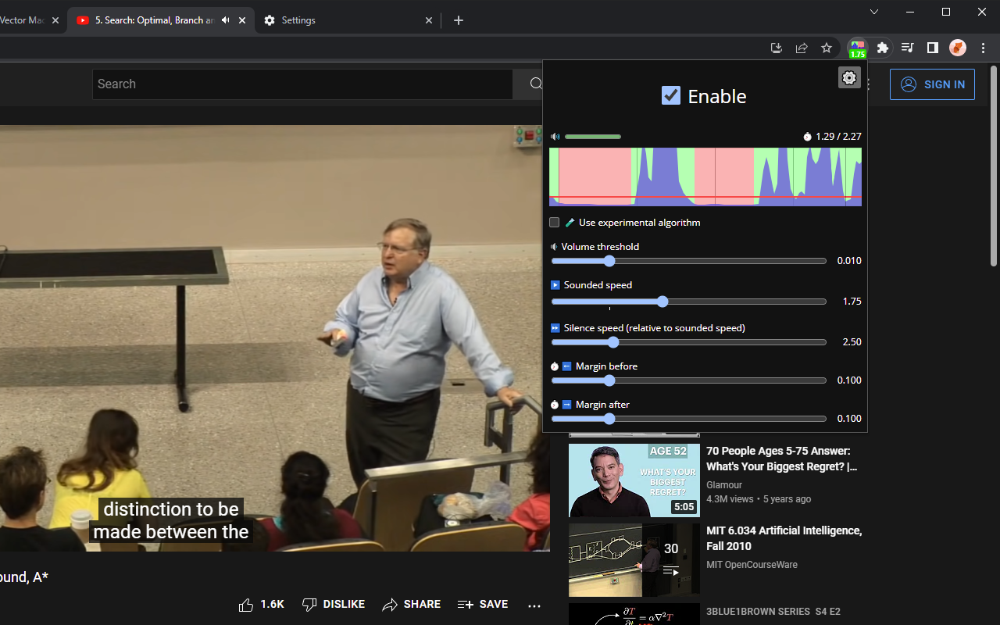

#  Jump Cutter

[][chrome-web-store]
[][addons-mozilla-org]
[](https://discord.gg/HCjghyT)

[][chrome-web-store]
[][addons-mozilla-org]

Plays silent parts of videos on the page at a faster speed.
Can be useful for watching lectures and other unedited videos.



Inspired by [this video](https://youtu.be/DQ8orIurGxw) by carykh.

## Build

1. Install base tools:
    * [Node.js](https://nodejs.org/).
    * [Yarn v1](https://classic.yarnpkg.com/docs/install).
2. Run

    ```bash
    yarn install
    ```

3.
    * To build for Gecko (e.g. Firefox):

    ```bash
    yarn build:gecko
    ```

    * To build for Chromium (e.g. Chrome)

    ```bash
    yarn build:chromium
    ```

    Bundled files will appear in `./dist`.

## Donate

* [bitcoin:bc1qdfz74882mlk64pj4ctpdegvxv9r7jgq8xs2qkxpv3gkv5xqygvgs0fyzm9](bitcoin:bc1qdfz74882mlk64pj4ctpdegvxv9r7jgq8xs2qkxpv3gkv5xqygvgs0fyzm9)
* https://liberapay.com/WofWca

[addons-mozilla-org]: https://addons.mozilla.org/firefox/addon/jump-cutter
[chrome-web-store]: https://chrome.google.com/webstore/detail/jump-cutter/lmppdpldfpfdlipofacekcfleacbbncp
