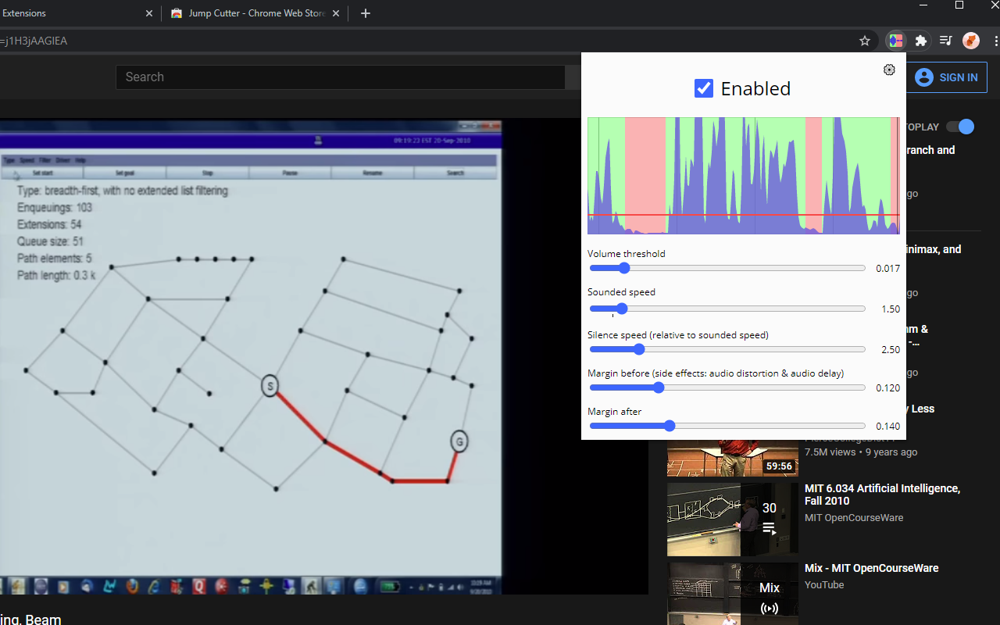

#  Jump Cutter

[](https://chrome.google.com/webstore/detail/jump-cutter/lmppdpldfpfdlipofacekcfleacbbncp)
[](https://addons.mozilla.org/firefox/addon/jump-cutter)
[](https://discord.gg/HCjghyT)

Plays silent parts of videos on the page at faster speed.
Can be useful for watching lectures and other unedited videos.



Inspired by [this video](https://youtu.be/DQ8orIurGxw) by carykh.

## Build

1. Install base tools:
    * [Node.js](https://nodejs.org/).
    * [Yarn v1](https://classic.yarnpkg.com/docs/install).
2. Run

    ```bash
    yarn install
    ```

3.
    * To build for Gecko (e.g. Firefox):

    ```bash
    yarn build:gecko
    ```

    * To build for Chromium (e.g. Chrome)

    ```bash
    yarn build:chromium
    ```

    Bundled files will appear in `./dist`.
