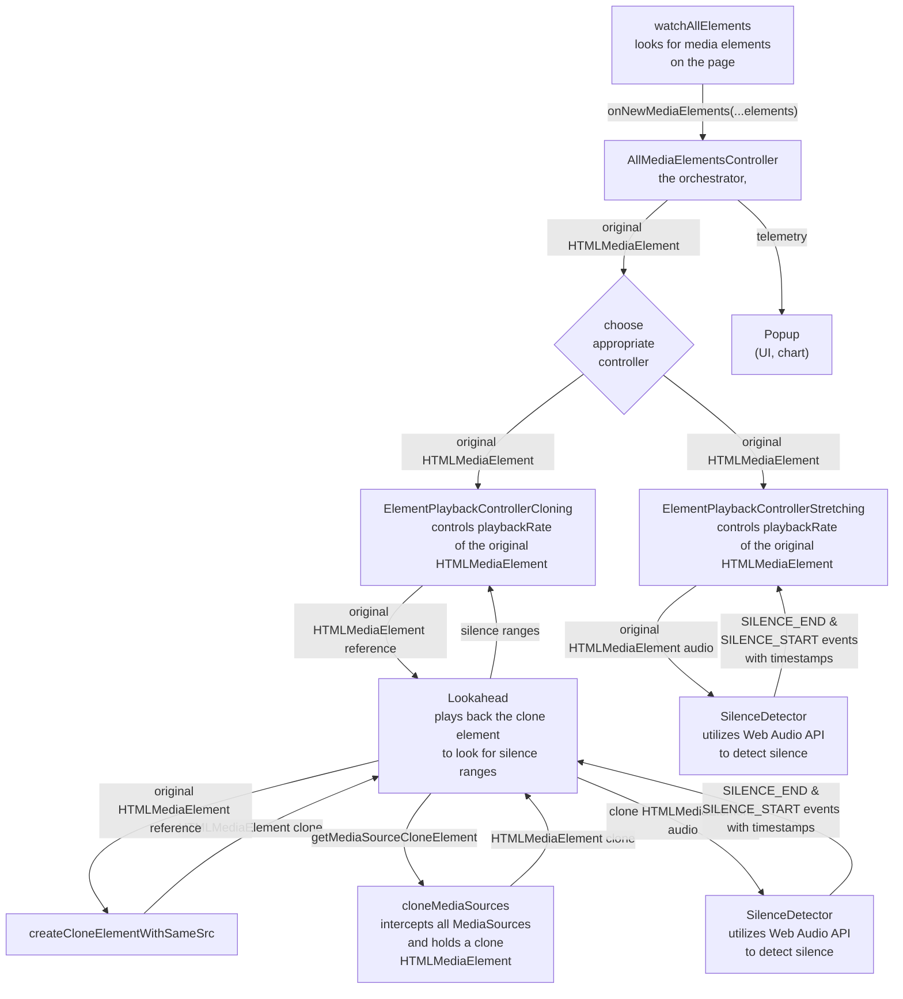

#  Jump Cutter

[][chrome-web-store]
[][addons-mozilla-org] <!-- [](https://liberapay.com/WofWca) --> [](https://matrix.to/#/#jump-cutter-extension:matrix.org)
[](https://discord.gg/HCjghyT)
[][weblate]

Download:

[][chrome-web-store]
[][addons-mozilla-org]
[][microsoft-edge-addons]
or from GitHub: [Chromium](https://github.com/WofWca/jumpcutter/releases/latest/download/lmppdpldfpfdlipofacekcfleacbbncp_main.crx
) / [Gecko (Firefox)](https://github.com/WofWca/jumpcutter/releases/latest/download/jump_cutter.xpi)

Skips silent parts in videos, in real time.

Can be useful for watching lectures, stream recordings (VODs), webinars, podcasts, and other unedited videos.

Demo:

<!-- TODO refactor: put the file in the repo so it's set in stone? -->
<!-- The source video:
https://ocw.mit.edu/courses/electrical-engineering-and-computer-science/6-034-artificial-intelligence-fall-2010/lecture-videos/lecture-16-learning-support-vector-machines/
(or https://youtu.be/_PwhiWxHK8o).
This video's license: CC BY-NC-SA 4.0 (https://creativecommons.org/licenses/by-nc-sa/4.0/).
Not sure if I did comply with the license here.
But I believe this use case would be considered "fair use" anyway.
 -->
<https://user-images.githubusercontent.com/39462442/131825020-5308b879-0509-41a3-95c9-bb4ad8938dc0.mp4>

Inspired by [this video](https://youtu.be/DQ8orIurGxw) by carykh.

## How it works

Simple (mostly).

<!--
Idk where to put this part. It seems out of place as an introduction,
because we don't really have to say anything about looking ahead
to explain the simpler case, when "margin before" is 0.
And both algorithms have their own pros and cons even with
"margin before" being 0.

With the current state of the web APIs,
there is no direct way to inspect audio samples of a media file/stream
anywhere other than at the current playback position of the media element.
Otherwise it would be pretty easy to employ the algorithms used in
the [analogous software](https://alternativeto.net/software/jump-cutter/),
such as

* [jump-cutter](https://github.com/jfkthame/jump-cutter)
* <https://github.com/carykh/jumpcutter>
* ExoPlayer ([SilenceSkippingAudioProcessor](https://github.com/google/ExoPlayer/blob/9c9f5a0599ec012d5cc46e3bd2e732a589adf61d/library/core/src/main/java/com/google/android/exoplayer2/audio/SilenceSkippingAudioProcessor.java))
* ffmpeg ([`silenceremove`](https://ffmpeg.org/ffmpeg-filters.html#toc-silenceremove))

So we have to work around that fact. -->

Currently there are 2 separate algorithms in place.

The first one we call "the stretching algorithm", and it's in [this file](./src/entry-points/content/ElementPlaybackControllerStretching/ElementPlaybackControllerStretching.ts). It simply looks at the output audio of a media element, determines its current loudness and, when it's not loud, increases its `playbackRate`. (We're using Web Audio API's
[`createMediaElementSource`](./src/entry-points/content/ElementPlaybackControllerStretching/ElementPlaybackControllerStretching.ts#L299)
and [`AudioWorkletProcessor`](./src/entry-points/content/SilenceDetector/SilenceDetectorProcessor.ts)
for this).

<details><summary>Details, why it's called "stretching"</summary>
The algorithm we just described cannot "look ahead" in the audio timeline.
It only looks at the current loudness, at the sample that we've already sent
to the audio output device.

But looking ahead (a.k.a. "Margin before") is important, because, for example,
there are certain sounds in speech that you can start a word with
that are not very loud.
But it's not good to skip such sounds just because of that.
The speech would become harder to understand.
For example, "throb" would become "rob".
<!-- You'd probably still understand what's being said based on the context,
but you'd need to use more mental effort. -->

Here is where the "stretching" part comes in.
It's about how we're able to "look ahead" and slow down
shortly before a loud part.
Basically it involves slightly (~200ms) _delaying_ the audio
before outputting it (and that is for a purpose!).

Imagine that we're currently playing a silent part,
so the playback rate is higher.
Now, when we encounter a loud part, we go
"aha! That might be a word, and it might start with 'th'".
<!-- , which we might not have marked as loud, because 'th' is not that loud" -->
As said above, we always delay (buffer) the audio for ~200ms
before outputting it.
So we know that these 200ms of buffered audio
must contain that "th" sound,
and we want the user to hear that "th" sound.
But remember: at the time we recorded the said sound,
the video was playing at _a high speed_,
but we want to play back that 'th' _at normal speed_.
So we can't just output it as is. What do we do?

What we do is we take that buffered (delayed) audio,
and we _slow it down_ (stretch and pitch-shift it)
so that it appears to have been played at normal speed!
Only then do we pass it to the system (which then passes it to your speakers).

And that, kids, is why we call it "the stretching algorithm".

For more details, you can check out the comments in its source code.
</details>

The second algorithm is "the cloning algorithm", and it's [here](./src/entry-points/content/ElementPlaybackControllerCloning/ElementPlaybackControllerCloning.ts). It creates a hidden clone of the target media element and plays it ahead of the original element, looking for silent parts and writing down where they are. When the target element reaches a silent part,
we increase its `playbackRate`, or skip (seek) the silent part entirely.
Currently you can enable this algorithm by checking the "Use the experimental algorithm" checkbox.

<!-- Referenced lines and lines might get shifted.
Need to reference specific commits perhaps,
but I don't want to link to GitHub. -->
We look for video elements by
[injecting a script in all pages](./src/manifest_base.json#L16-L23)
and simply
[`document.getElementsByTagName('video')`](./src/entry-points/content/watchAllElements.ts#L37).
But new video elements could get inserted
_after_ the page has already loaded,
so we [watch for new elements with a `MutationObserver`](./src/entry-points/content/watchAllElements.ts#L90).

<details><summary>High-level architecture chart</summary>

If below you see a block of text instead of a chart,
go [here](https://mermaid.ink/img/pako:eNrNWG1vm0gQ_isrTqlaKTEs7_jDSVES6Sr1JapzinT16bosszYNsGhZmqZx_nsXsI3BsbGvul5tOYFhdmb2mZmHgUeN8gi0sTYTJJ9Ps5OT-gDdXE6zaYbU5-QE3by_fI9IFKEkzu4KNJcyL8a6noJISRyNPhcjLmZ68ZBJ8lVnCb-ncyLkaC7T5Lc4kyAIlTHPVhbviaTz8yS5SiCFTBYfp1pf1ChWn4Rz5ZJxgVKIYoJgS4NnSM4B5WQGU-3vRk6TmN5tOUJTbRX7LJbzMhxRnuq3nN1Son8u05yWUkWrhwkPdT8wiBmaTmD7zAoYdhyLhgFhoeFSm1Js0CAyCQ70QlBdWRcPZzlXuy10ytWeM6n33Y9U1NoKBCV_W21odfFCLRI8SUAoOHZfbLdd7ZkLOodCCiK5OO1tfreNo2CwbUaiEAe-yULwosg0qGt7NiYQgOfYIQlMFxu2uRuG3YF0ANlK1tnZ74upxrN3cN9Z_3I0Gq2q4NVUW6AhtPYgUfngIp7FGUnQHzdv32wqLhCdc15Aq__YCNokkDwXPBcxkRtCutZ_WiakZ2bI7fLgOiEPIaF37cKLhGdxNkMvdqtMpAAFpNKaZhstPGRyQ7Uow4YDptrgqnX2hjQ_HmCsD2CB8qXuhw6-nC2LvwGwvdBHstcRg7Ae0xcWYwbGFvYjqkjBNjwgLGCKGPzIsiJG1NcIHQt298VQOIMKnfZ5o3iSzIFECun1cQtNhWSBKjM1dlRZgBWXbnAKr_m2ptsiTiCjgATJZlD0oFx7OAqzwPeBWgYOmQkuVZC5lFqmzzyL2NjzmOcYNsOAfwCzdWAdcAYzrxoSLdDOlkQCGIgKjgXqgdsiUdvoorY4uO-oAFXjlRCWS24VnBOSwkTQxvRWUHUShwI6aE97vW_mfX-Yx9QCBBFhDJtm9XMt4hgsxNQm2AA7xBb1WIQDg7IfqIW9wXbqo0ayBmfCS0GhGkk-bQnbPqmHGgq5ukuRJEHPK5EsQnOeREqncbCbqD712mvL9VHQOiFlClzHMlyXOoTazHVtMPwgDLCLsU8YWB6BPbfsLf96Eof7Eavvaf-mRBczkBuGNtO1QM_koDExafrsEiRQNfxglbCeqEW7lHESf1Mh3kKIzsso5uj8-nWH9aJ60Yrzetno-zquzhXBWY5hEFDtFgQ28UNwwlCVd1QRn-GDHzjM3lPnPff982vBFS4FX01Tz3BAw_ZbySEVFIut7T0PcGOpBW3y-s3Vu4urf67eXaIX2-LJzfmHGwRfuqP6vYILyThVMytJ8-WFTnmspxDIlsUyPMJ0R54jppiNhcO3ilb542Em_7dxpo3hV5lo2ogO0ekQTa8OzZ_Y6Oav3-iH1MDAGPA8C5jPo_9fssBx_V3zw-Y7inqYVage8dBz2HNUs2e5sr__ebPxfc3zMleVWv9vN_7yz9enqH438qpXebXiT3ouzytf-nmej4ovkCgm0g55TO4gUIernWrLN0DaWHusbEw1RWSpMjhWhxEwUiaysv6kVEkp-eQho9pYihJONcHL2VwbM5IU6qzMI8WJlzFRnJ2uVHKS_cV5ulZS59r4Ufuqjc-cAI8C9cf1bN-wXd8_1R4qsWMqsWl6hmN4Pjadp1PtW20Cj3wHO2r4MbFl2b5tPX0HOWuO6Q?type=png).



</details>

<!-- FYI this section is linked from CONTRIBUTING.md -->
## Contribute

* [🌐 Translate (on Weblate)][weblate]
* 👨‍💻 Code. See [CONTRIBUTING.md](./CONTRIBUTING.md) on how to get started. And feel free to contact me.
* [💸 Donate](#donate)
* General feedback and questioning my decisions is appreciated

<!-- FYI this section is linked from CONTRIBUTING.md -->
## Build

1. Install base tools:
    * [Node.js](https://nodejs.org/).
    * [Yarn v1](https://classic.yarnpkg.com/docs/install).
2. Run

    ```bash
    yarn install
    ```

3.
    Fill the `src/_locales` directory with localization files. Skip this step if they're already there. Either:

    * If you're using `git`:

        `git submodule update --init`

    * If you don't want to use `git`, download them from the `translations` branch and put in `src/_locales` manually.

4.
    * To build for Gecko (e.g. Firefox):

        ```bash
        yarn build:gecko
        ```

    * To build for Chromium (e.g. Chrome, Edge)

        ```bash
        yarn build:chromium
        ```

    Bundled files will appear in `./dist-gecko` (or `./dist-chromium`).

For development build, see [CONTRIBUTING.md](./CONTRIBUTING.md)

Then you can install it on the extensions management page of your browser ([Chromium](https://developer.chrome.com/docs/extensions/mv3/getstarted/#unpacked), [Gecko](https://developer.mozilla.org/en-US/docs/Mozilla/Add-ons/WebExtensions/Your_first_WebExtension#installing)).

## Privacy & security

In short: it's fine.

As with practically every other extension, websites you're visiting _may_ detect that you're using this (or alike) extension, and your settings for the extension, by observing:

* playback rate changes of an element.
* the fact that `createMediaElementSource` has been called for an element.
* increased frequency of media chunk requests resulting from increased playback rate. This cannot be mitigated with disabling JavaScript.
* the fact of requesting the same media twice, as a result of using the cloning algotihm.

However I doubt that currently there are services that do specifically this. But there may be.

Other than that, there are no known things concerning this. It doesn't interact with third parties or try to do other creepy stuff.

## Why is it free?

It started out as a hobby project in 2019
and you could say it remains such today.
It feels good to write software that thousands of people use,
to give back to the humanity.

However I am still thinking of monetizing it, in a liberal way.
I really like
[FUTO's take on it](https://www.futo.org/about/what-does-futo-believe/),
and their "infinite free trial" thing they do with e.g.
[FUTO Keyboard](https://keyboard.futo.org/).

However, with the current amount of users
I think it's not worth the effort right now.

<details><summary>About donations</summary>

Donations are great, but what they do is tell the user
"we don't really want money, but if you insist, you can send some",
or even "nobody pays for this product,
so you'll be one of the generous few,
and if you donate $5 I'll only be able to buy one coffee with it
and will not really be incentivized to continue the development".

<!-- Isn't this turning into a blog post rant? -->
A lot of people are willing to pay. They want to really purchase the product
and be done with it fair and square
instead of running a charity
and throwing money at the bottomless pit of "coffees",
wondering "did I give enough?".

Of course by this I'm not saying I don't appreciate donations.
They mean a lot to me. They are more personal.
I am just describing that in terms of revenue they're not as powerful.

</details>

Anyways, it is extremely unlikely that this software will go closed-source
or be sold out,
especially given that I am not its only contributor.
I have already been offered $1000 for it,
but this doesn't even cover the hours I spent on it.
So, unless it's a life-changing amount of money
(in which case I'd be able to fund another project like this!),
I am not really considering it.

## Donate

* <https://antiwarcommittee.info/en/sunrise/#help>
* Monero (XMR):

  > <monero:88yzE5FbDoMVLXUXkbJXVHjNpP5S3xkMaTwBSxmetBDvQMbecMtVCXnQ44W6WRYsPGCPoAYp74ER9aDgBLYDGAAiSt2wu8a?tx_amount=0.050000000000&recipient_name=WofWca%20(https%3A//github.com/WofWca)&tx_description=Donation%20for%20Jump%20Cutter%20extension%20development>
* Bitcoin (BTC):

  > <bitcoin:bc1qdfz74882mlk64pj4ctpdegvxv9r7jgq8xs2qkxpv3gkv5xqygvgs0fyzm9>
<!-- * <https://liberapay.com/WofWca> -->

<br>
<br>
<br>

[](./COPYING)

[addons-mozilla-org]: https://addons.mozilla.org/firefox/addon/jump-cutter
[chrome-web-store]: https://chrome.google.com/webstore/detail/jump-cutter/lmppdpldfpfdlipofacekcfleacbbncp
[microsoft-edge-addons]: https://microsoftedge.microsoft.com/addons/detail/jlbjhoaphnkkjdafpjomedllppldjkbj
[weblate]: https://hosted.weblate.org/engage/jump-cutter/
